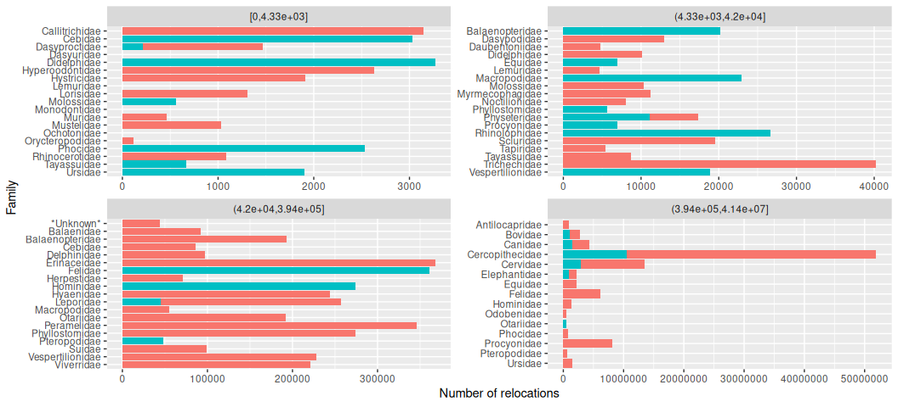

Movebank Results
================
Alec Robitaille
2020-09-30

    # Packages ----------------------------------------------------------------
    library(data.table)
    library(taxize)
    library(ggplot2)
    library(patchwork)

    # Data --------------------------------------------------------------------
    details <- fread('data-sources/details.csv')
    taxes <- fread('data-sources/taxes.csv')
    DT <- fread('data-sources/taxed-details.csv')

`taxon_ids` column

    details[, .N, .(is.na(taxon_ids), taxon_ids == '')]

| is.na | taxon\_ids |    N |
|:------|:-----------|-----:|
| FALSE | FALSE      | 2434 |
| FALSE | TRUE       | 1644 |

Out of 1644 rows with seemingly valid `taxon_ids`, there are up to 17
species listed in any row. Eg.

    details[id == 422952928]$taxon_ids

    ## [1] "Anser albifrons,Chen caerulescens,Chen rossii,Anas platyrhynchos,Anas strepera,Anas acuta,Anas crecca,Anas discors,Anas cyanoptera,Anas americana,Anas clypeata,Aythya valisineria,Aythya marila,Circus cyaneus,Phasianus colchicus"

Grabbing the family and class, then combining the taxonomies with the
study details dataset, we have 4784 species by study rows.

TODO: N access, family, class, access by taxonomy etc

    DT[, .N, class]

| class          |    N |
|:---------------|-----:|
|                | 1704 |
| Aves           | 2180 |
| Mammalia       |  744 |
| Insecta        |    2 |
| Chondrostei    |    1 |
| Reptilia       |  106 |
| Amphibia       |    2 |
| Teleostei      |   10 |
| Chondrichthyes |   35 |

    ggplot(DT) + 
        geom_bar(aes(class, fill = i_have_download_access)) +
        guides(fill = FALSE)

<!-- -->

Careful double counting, because the `DT` dataset now has duplicated
study rows for each parsed taxon.

    # Grab the unique rows based on study id
    countDT <- unique(DT, by = 'id')

*Mammalia*
==========

Just exploring mammals, the following figures show download access TRUE
in blue, and FALSE in red. **Note: counts are log scaled**.

Number of studies by family
---------------------------

    ggplot(countDT[class == 'Mammalia']) + 
        geom_bar(aes(factor(family, sort(unique(family), TRUE)),
                                 fill = i_have_download_access)) +
        coord_flip() +
        scale_y_log10() +
        labs(y = 'Number of studies', x = 'Family') +
        guides(fill = FALSE)

<!-- -->

Number of individuals by family
-------------------------------

    ggplot(countDT[class == 'Mammalia', sum(number_of_individuals, na.rm = TRUE), .(i_have_download_access, family)]) + 
        geom_col(aes(factor(family, sort(unique(family), TRUE)),
                                 V1,
                                 fill = i_have_download_access)) +
      scale_y_log10() +
        coord_flip() +
        labs(y = 'Number of individuals', x = 'Family')  +
        guides(fill = FALSE)

<!-- -->

Number of relocations by family
-------------------------------

    ggplot(countDT[class == 'Mammalia', sum(number_of_deployed_locations, na.rm = TRUE), .(i_have_download_access, family)]) + 
        geom_col(aes(factor(family, sort(unique(family), TRUE)),
                                 V1,
                                 fill = i_have_download_access)) +
        scale_y_log10() +
        coord_flip() +
        labs(y = 'Number of relocations', x = 'Family') +
        guides(fill = FALSE)

    ## Warning: Transformation introduced infinite values in continuous y-axis

    ## Warning: Removed 4 rows containing missing values (geom_col).

<!-- -->

    countDT[, .(N = sum(number_of_deployed_locations), family = family[[1]], class = class[[1]],
                            i_have_download_access = i_have_download_access[[1]]), 
                    by = matched_name][order(-N, class)][, .SD[1:3], by = class]

| class          | matched\_name         |         N | family          | i\_have\_download\_access |
|:---------------|:----------------------|----------:|:----------------|:--------------------------|
| Aves           | Polemaetus bellicosus | 560042216 | Accipitridae    | FALSE                     |
| Aves           | Ciconia ciconia       | 148625180 | Ciconiidae      | FALSE                     |
| Aves           | Neophron percnopterus | 104118230 | Accipitridae    | FALSE                     |
| Mammalia       | Papio                 |  29691006 | Cercopithecidae | FALSE                     |
| Mammalia       | Papio anubis          |  21920781 | Cercopithecidae | FALSE                     |
| Mammalia       | Nasua narica          |   7447496 | Procyonidae     | TRUE                      |
|                | Hieraaetus fasciatus  |  13971973 |                 | FALSE                     |
|                | Larus audouinii       |    221826 |                 | FALSE                     |
|                | Phoenicopterus minor  |    194862 |                 | FALSE                     |
| Reptilia       | Chelonoidis           |   2237506 | Testudinidae    | TRUE                      |
| Reptilia       | Tiliqua               |   1783379 | Scincidae       | FALSE                     |
| Reptilia       | Testudinidae          |   1672704 | Testudinidae    | FALSE                     |
| Teleostei      | Sciaenops ocellatus   |    289269 | Sciaenidae      | FALSE                     |
| Teleostei      | Gadus ogac            |    166947 | Gadidae         | FALSE                     |
| Teleostei      | Anguilla anguilla     |    165910 | Anguillidae     | FALSE                     |
| Chondrichthyes | Isurus oxyrinchus     |     66234 | Lamnidae        | FALSE                     |
| Chondrichthyes | Carcharias taurus     |     37165 | Odontaspididae  | FALSE                     |
| Chondrichthyes | Galeocerdo cuvier     |     18131 | Carcharhinidae  | FALSE                     |
| Chondrostei    | Acipenser oxyrinchus  |     21796 | Acipenseridae   | FALSE                     |
| Chondrostei    | NA                    |        NA | NA              | NA                        |
| Chondrostei    | NA                    |        NA | NA              | NA                        |
| Amphibia       | Bufo bufo             |       277 | Bufonidae       | TRUE                      |
| Amphibia       | Amphibia              |        NA |                 | FALSE                     |
| Amphibia       | NA                    |        NA | NA              | NA                        |
| Insecta        | Acherontiini          |       274 | Sphingidae      | FALSE                     |
| Insecta        | Exaerete frontalis    |       111 | Apidae          | TRUE                      |
| Insecta        | NA                    |        NA | NA              | NA                        |

Some elements of the database are strange. How do these datasets have
last deployed timestamps in the 10-25 year future?

    DT[matched_name == 'Polemaetus bellicosus'][, .(
        matched_name,
        family,
        class,
        sensor_type_ids,
        timestamp_first_deployed_location,
        timestamp_last_deployed_location,
        number_of_deployed_locations
    )]

| matched\_name         | family       | class | sensor\_type\_ids                                    | timestamp\_first\_deployed\_location | timestamp\_last\_deployed\_location | number\_of\_deployed\_locations |
|:----------------------|:-------------|:------|:-----------------------------------------------------|:-------------------------------------|:------------------------------------|--------------------------------:|
| Polemaetus bellicosus | Accipitridae | Aves  | GPS,Acceleration,Accessory Measurements,Magnetometer | 2016-07-14 04:00:43.000              | 2047-08-20 08:33:16.000             |                        21629202 |
| Polemaetus bellicosus | Accipitridae | Aves  | GPS                                                  | 2020-03-04 22:00:34.000              | 2020-09-25 20:05:30.000             |                           26175 |
| Polemaetus bellicosus | Accipitridae | Aves  | GPS,Acceleration,Accessory Measurements,Magnetometer | 2019-10-09 00:19:06.000              | 2032-02-14 23:52:59.000             |                          185628 |
| Polemaetus bellicosus | Accipitridae | Aves  | GPS,Argos Doppler Shift,Accessory Measurements       | 2013-07-30 17:00:00.000              | 2020-08-11 17:51:37.000             |                           95681 |
| Polemaetus bellicosus | Accipitridae | Aves  | GPS                                                  | 2013-07-30 17:00:00.000              | 2016-09-21 06:00:00.000             |                           44285 |
| Polemaetus bellicosus | Accipitridae | Aves  | GPS,Acceleration                                     | 2016-09-08 07:56:44.000              | 2032-01-07 03:10:07.000             |                       559690447 |

