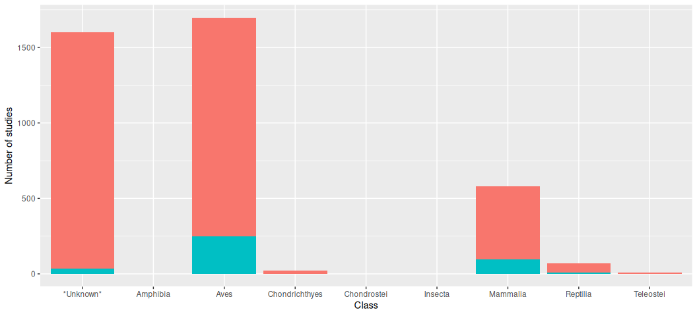

Movebank Results
================
Alec Robitaille
2020-09-30

    # Packages ----------------------------------------------------------------
    library(data.table)
    library(taxize)
    library(ggplot2)

    # Data --------------------------------------------------------------------
    details <- fread('data-sources/details.csv')
    taxes <- fread('data-sources/taxes.csv')
    DT <- fread('data-sources/taxed-details.csv')

`taxon_ids` column

    details[, .N, .(is.na(taxon_ids), taxon_ids == '')]

| is.na | taxon\_ids |    N |
|:------|:-----------|-----:|
| FALSE | FALSE      | 2434 |
| FALSE | TRUE       | 1644 |

Out of 1644 rows with seemingly valid `taxon_ids`, there are up to 17
species listed in any row. Eg.

    details[id == 422952928]$taxon_ids

    ## [1] "Anser albifrons,Chen caerulescens,Chen rossii,Anas platyrhynchos,Anas strepera,Anas acuta,Anas crecca,Anas discors,Anas cyanoptera,Anas americana,Anas clypeata,Aythya valisineria,Aythya marila,Circus cyaneus,Phasianus colchicus"

Grabbing the family and class, then combining the taxonomies with the
study details dataset, we have 4784 species by study rows.

TODO: N access, family, class, access by taxonomy etc

    DT[, .N, class]

| class          |    N |
|:---------------|-----:|
|                | 1704 |
| Aves           | 2180 |
| Mammalia       |  744 |
| Insecta        |    2 |
| Chondrostei    |    1 |
| Reptilia       |  106 |
| Amphibia       |    2 |
| Teleostei      |   10 |
| Chondrichthyes |   35 |

    ggplot(DT) + 
        geom_bar(aes(class))

<!-- -->

    ggplot(DT[class == 'Mammalia']) + 
        geom_bar(aes(factor(family, sort(unique(family), TRUE)),
                                 fill = i_have_download_access)) +
        coord_flip() +
        labs(x = 'Number of studies', y = 'Family')

<!-- -->

    ggplot(DT[class == 'Mammalia']) + 
        geom_bar(aes(factor(family, sort(unique(family), TRUE)),
                                 fill = factor(i_have_download_access))) +
        coord_flip() +
        labs(y = 'Number of studies', x = 'Family')

<!-- -->

    ggplot(DT[class == 'Mammalia', sum(number_of_individuals), .(i_have_download_access, family)]) + 
        geom_col(aes(factor(family, sort(unique(family), TRUE)),
                                 V1,
                                 fill = factor(i_have_download_access))) +
        coord_flip() +
        labs(y = 'Number of individuals', x = 'Family')

<!-- -->

    ggplot(DT[class == 'Mammalia', sum(number_of_deployed_locations), .(i_have_download_access, family)]) + 
        geom_col(aes(factor(family, sort(unique(family), TRUE)),
                                 V1,
                                 fill = factor(i_have_download_access))) +
        coord_flip() +
        labs(y = 'Number of relocations', x = 'Family')

    ## Warning: Removed 20 rows containing missing values (position_stack).

<!-- -->
