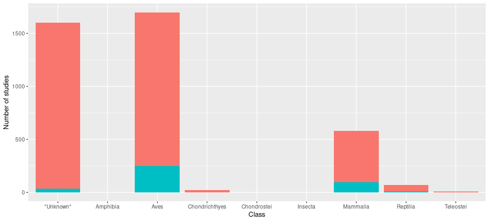
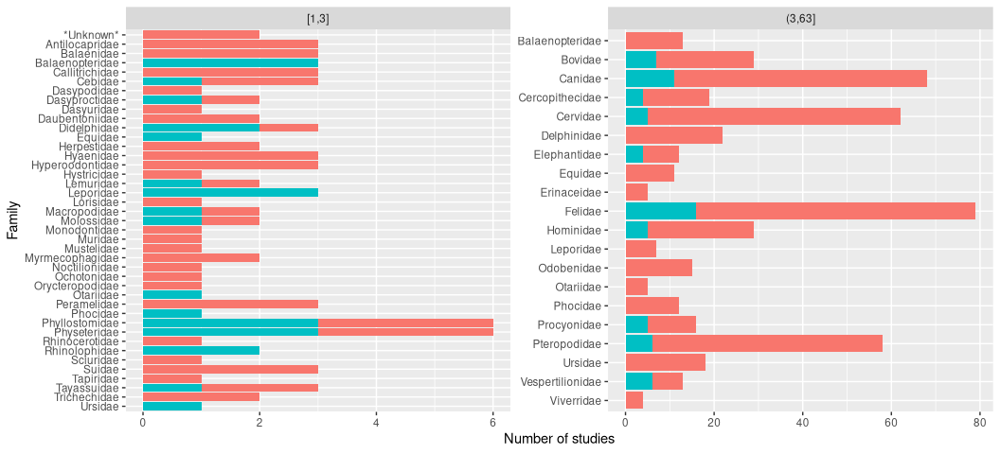
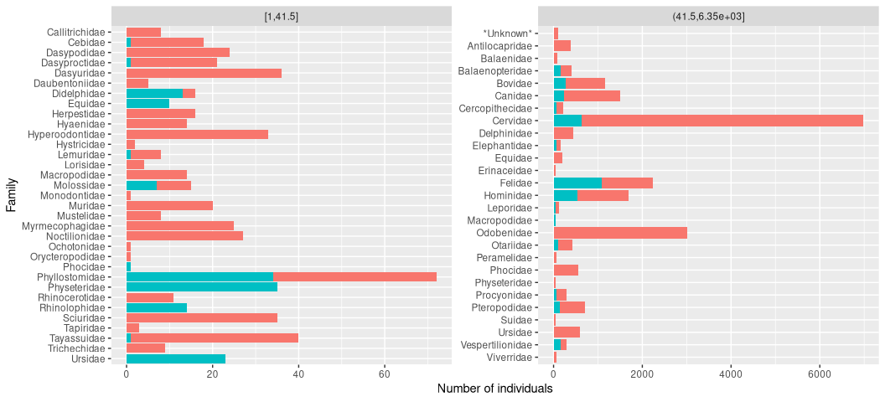
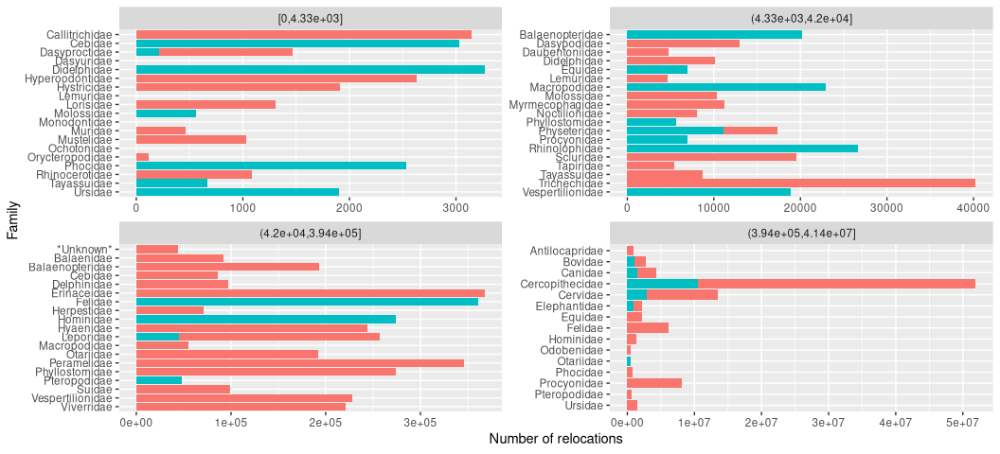

Movebank Results
================
Alec Robitaille
2021-03-16

``` r
# Packages ----------------------------------------------------------------
library(data.table)
library(taxize)
library(ggplot2)
library(patchwork)
```

``` r
# Data --------------------------------------------------------------------
details <- fread('derived/data-sources/details.csv')
taxes <- fread('derived/data-sources/taxes.csv')
DT <- fread('derived/data-sources/taxed-details.csv')
```

`taxon_ids` column

``` r
details[, .N, .(is.na(taxon_ids), taxon_ids == '')]
```

<div class="kable-table">

| is.na | taxon\_ids |    N |
|:------|:-----------|-----:|
| FALSE | FALSE      | 2434 |
| FALSE | TRUE       | 1644 |

</div>

Out of 1644 rows with seemingly valid `taxon_ids`, there are up to 17
species listed in any row. Eg.

``` r
details[id == 422952928]$taxon_ids
```

    ## [1] "Anser albifrons,Chen caerulescens,Chen rossii,Anas platyrhynchos,Anas strepera,Anas acuta,Anas crecca,Anas discors,Anas cyanoptera,Anas americana,Anas clypeata,Aythya valisineria,Aythya marila,Circus cyaneus,Phasianus colchicus"

Grabbing the family and class, then combining the taxonomies with the
study details dataset, we have 4784 species by study rows.

``` r
# First, recode missing class and family
DT[class == "" | is.na(class), class := "*Unknown*"]
DT[family == "" | is.na(family), family := "*Unknown*"]
```

Careful double counting, because the `DT` dataset now has duplicated
study rows for each parsed taxon.

``` r
# Grab the unique rows based on study id
countDT <- unique(DT, by = 'id')


# Count by class
countDT[, .N, class][order(class)]
```

<div class="kable-table">

| class          |    N |
|:---------------|-----:|
| *Unknown*      | 1602 |
| Amphibia       |    2 |
| Aves           | 1698 |
| Chondrichthyes |   20 |
| Chondrostei    |    1 |
| Insecta        |    2 |
| Mammalia       |  582 |
| Reptilia       |   71 |
| Teleostei      |   10 |

</div>

``` r
ggplot(countDT) + 
    geom_bar(aes(class, fill = i_have_download_access)) +
    guides(fill = FALSE) +
    # scale_y_log10() +
    labs(x = 'Class', y = 'Number of studies')
```



# *Mammalia*

Just exploring mammals, the following figures show download access TRUE
in blue, and FALSE in red. Note: the plots are separated into chunks
based on an even number of observations in each chunk.

``` r
# Set up the base plot
g <- ggplot() + 
    geom_col(aes(factor(family, sort(unique(family), TRUE)), y,
                             fill = i_have_download_access)) +
  facet_wrap(~ cut_number(y, 2), scales = 'free') +
    coord_flip() + 
    guides(fill = FALSE)
```

## Number of studies by family

``` r
g %+% countDT[class == 'Mammalia', .(y = .N), .(i_have_download_access, family)] +
    labs(y = 'Number of studies', x = 'Family')
```



## Number of individuals by family

``` r
g %+% countDT[class == 'Mammalia', .(y = sum(number_of_individuals, na.rm = TRUE)),
                            .(i_have_download_access, family)] +
    labs(y = 'Number of individuals', x = 'Family')
```



## Number of relocations by family

``` r
g %+% countDT[class == 'Mammalia', .(y = sum(number_of_deployed_locations, na.rm = TRUE)),
                            .(i_have_download_access, family)] +
    labs(y = 'Number of relocations', x = 'Family') +
    facet_wrap(~cut_number(y, 4), scales = 'free')
```



## Top number of relocations by species and study

``` r
countDT[, .(N = sum(number_of_deployed_locations), family = family[[1]], class = class[[1]],
                        i_have_download_access = i_have_download_access[[1]]), 
                by = matched_name][order(-N, class)][, .SD[1:3], by = class]
```

<div class="kable-table">

| class          | matched\_name         |         N | family          | i\_have\_download\_access |
|:---------------|:----------------------|----------:|:----------------|:--------------------------|
| Aves           | Polemaetus bellicosus | 560042216 | Accipitridae    | FALSE                     |
| Aves           | Ciconia ciconia       | 148625180 | Ciconiidae      | FALSE                     |
| Aves           | Neophron percnopterus | 104118230 | Accipitridae    | FALSE                     |
| Mammalia       | Papio                 |  29691006 | Cercopithecidae | FALSE                     |
| Mammalia       | Papio anubis          |  21920781 | Cercopithecidae | FALSE                     |
| Mammalia       | Nasua narica          |   7447496 | Procyonidae     | TRUE                      |
| *Unknown*      | Hieraaetus fasciatus  |  13971973 | *Unknown*       | FALSE                     |
| *Unknown*      | Larus audouinii       |    221826 | *Unknown*       | FALSE                     |
| *Unknown*      | Phoenicopterus minor  |    194862 | *Unknown*       | FALSE                     |
| Reptilia       | Chelonoidis           |   2237506 | Testudinidae    | TRUE                      |
| Reptilia       | Tiliqua               |   1783379 | Scincidae       | FALSE                     |
| Reptilia       | Testudinidae          |   1672704 | Testudinidae    | FALSE                     |
| Teleostei      | Sciaenops ocellatus   |    289269 | Sciaenidae      | FALSE                     |
| Teleostei      | Gadus ogac            |    166947 | Gadidae         | FALSE                     |
| Teleostei      | Anguilla anguilla     |    165910 | Anguillidae     | FALSE                     |
| Chondrichthyes | Isurus oxyrinchus     |     66234 | Lamnidae        | FALSE                     |
| Chondrichthyes | Carcharias taurus     |     37165 | Odontaspididae  | FALSE                     |
| Chondrichthyes | Galeocerdo cuvier     |     18131 | Carcharhinidae  | FALSE                     |
| Chondrostei    | Acipenser oxyrinchus  |     21796 | Acipenseridae   | FALSE                     |
| Chondrostei    | NA                    |        NA | NA              | NA                        |
| Chondrostei    | NA                    |        NA | NA              | NA                        |
| Amphibia       | Bufo bufo             |       277 | Bufonidae       | TRUE                      |
| Amphibia       | Amphibia              |        NA | *Unknown*       | FALSE                     |
| Amphibia       | NA                    |        NA | NA              | NA                        |
| Insecta        | Acherontiini          |       274 | Sphingidae      | FALSE                     |
| Insecta        | Exaerete frontalis    |       111 | Apidae          | TRUE                      |
| Insecta        | NA                    |        NA | NA              | NA                        |

</div>

## Etc

Some elements of the database are strange. How do these datasets have
last deployed timestamps in the 10-25 year future?

``` r
DT[matched_name == 'Polemaetus bellicosus'][, .(
    matched_name,
    family,
    class,
    sensor_type_ids,
    timestamp_first_deployed_location,
    timestamp_last_deployed_location,
    number_of_deployed_locations
)]
```

<div class="kable-table">

| matched\_name         | family       | class | sensor\_type\_ids                                    | timestamp\_first\_deployed\_location | timestamp\_last\_deployed\_location | number\_of\_deployed\_locations |
|:----------------------|:-------------|:------|:-----------------------------------------------------|:-------------------------------------|:------------------------------------|--------------------------------:|
| Polemaetus bellicosus | Accipitridae | Aves  | GPS,Acceleration,Accessory Measurements,Magnetometer | 2016-07-14 04:00:43                  | 2047-08-20 08:33:16                 |                        21629202 |
| Polemaetus bellicosus | Accipitridae | Aves  | GPS                                                  | 2020-03-04 22:00:34                  | 2020-09-25 20:05:30                 |                           26175 |
| Polemaetus bellicosus | Accipitridae | Aves  | GPS,Acceleration,Accessory Measurements,Magnetometer | 2019-10-09 00:19:06                  | 2032-02-14 23:52:59                 |                          185628 |
| Polemaetus bellicosus | Accipitridae | Aves  | GPS,Argos Doppler Shift,Accessory Measurements       | 2013-07-30 17:00:00                  | 2020-08-11 17:51:37                 |                           95681 |
| Polemaetus bellicosus | Accipitridae | Aves  | GPS                                                  | 2013-07-30 17:00:00                  | 2016-09-21 06:00:00                 |                           44285 |
| Polemaetus bellicosus | Accipitridae | Aves  | GPS,Acceleration                                     | 2016-09-08 07:56:44                  | 2032-01-07 03:10:07                 |                       559690447 |

</div>
